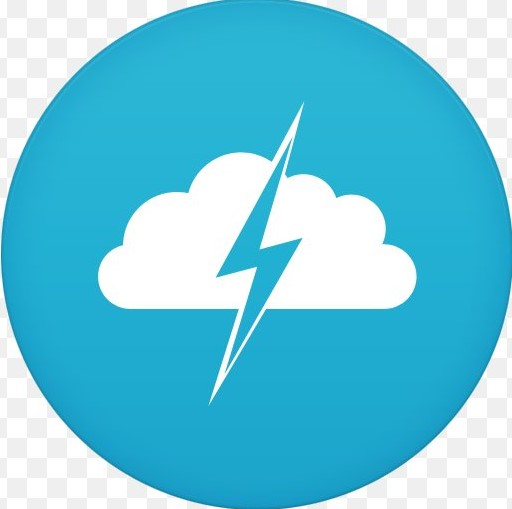

<!-- PROJECT SHIELDS -->

[![Contributors][contributors-shield]][contributors-url]
[![Forks][forks-shield]][forks-url]
[![Stargazers][stars-shield]][stars-url]
[![Issues][issues-shield]][issues-url]
[![MIT License][license-shield]][license-url]
[![LinkedIn][linkedin-shield]][linkedin-url]

<!-- PROJECT LOGO -->
<br />
<p align="center">
    
  
  <h3 align="center">TOP - Weather App</h3>

  <p align="center"> 
   A seamless weather app! Get the latest weather from around the world.
    <br />
    <br />
    <a href="https://convale.github.io/TOP-WeatherApp/">View Demo</a>
    ·
    <a href="https://github.com/Convale/TOP-WeatherApp/issues">Report Bug</a>
    ·
    <a href="https://github.com/Convale/TOP-WeatherApp/issues">Request Feature</a>
  </p>
</p>

<!-- TABLE OF CONTENTS -->

## Table of Contents

- [About the Project](#about-the-project)
  - [Built With](#built-with)
- [Getting Started](#getting-started)
  - [Prerequisites](#prerequisites)
  - [Installation](#installation)
- [Roadmap](#roadmap)
- [Contributing](#contributing)
- [License](#license)

<!-- ABOUT THE PROJECT -->

## About The Project

[![Weather App Screen Shot][product-screenshot]](https://convale.github.io/TOP-WeatherApp/)

A modern weather app to keep up with the weather, wind, and humidity. It stores your last location in localStorage for ease to the user.

To change the city, click on the current city name.

This is part of The ODIN Project's Fullstack Javascript Bootcamp to teach budding web developers the basics.
Want to learn to be a web developer? [Check out The ODIN Project](https://www.theodinproject.com/)

### Built With

- HTML / CSS / Javascript
- [React](https://reactjs.org/)
- localStorage

<!-- GETTING STARTED -->

## Getting Started

### Prerequisites

- npm

```sh
npm install npm@latest -g
```

### Installation

1.  Get a free API Key at [OpenWeather](https://openweathermap.org/)
2.  Clone the repo

```sh
git clone https://github.com/Convale/TOP-WeatherApp.git
```

3.  Install NPM packages

```sh
npm install
```

4.  Follow `.env.sample` to deploy the API Key

```sh
REACT_APP_WEATHER_API_KEY = <YOUR_API_KEY>
```

<!-- ROADMAP -->

## Roadmap

See the [open issues](https://github.com/Convale/TOP-WeatherApp/issues) for a list of proposed features (and known issues).

Future Implementations:

- ability to change the tempurature unit (F/C)
- Continuos update
- ability to ask for geolocation from browser
- animate the city search bar to open up / close down
- add 5 day weather forecast
- add air quality information (https://www.iqair.com/us/air-pollution-data-api)

<!-- CONTRIBUTING -->

## Contributing

Contributions are what make the open source community such an amazing place to be learn, inspire, and create. Any contributions you make are **greatly appreciated**.

1. Fork the Project
2. Create your Feature Branch (`git checkout -b feature/AmazingFeature`)
3. Commit your Changes (`git commit -m 'Add some AmazingFeature'`)
4. Push to the Branch (`git push origin feature/AmazingFeature`)
5. Open a Pull Request

<!-- LICENSE -->

## License

Distributed under the MIT License. See [`LICENSE`](https://github.com/Convale/TOP-WeatherApp/blob/master/LICENSE) for more information.

<!-- MARKDOWN LINKS & IMAGES -->

[contributors-shield]: https://img.shields.io/github/contributors/Convale/TOP-WeatherApp
[contributors-url]: https://github.com/Convale/TOP-WeatherApp/graphs/contributors
[forks-shield]: https://img.shields.io/github/forks/Convale/TOP-WeatherApp
[forks-url]: https://github.com/Convale/TOP-WeatherApp/network/members
[stars-shield]: https://img.shields.io/github/stars/Convale/TOP-WeatherApp
[stars-url]: https://github.com/Convale/TOP-WeatherApp/stargazers
[issues-shield]: https://img.shields.io/github/issues/Convale/TOP-WeatherApp
[issues-url]: https://github.com/Convale/TOP-WeatherApp/issues
[license-shield]: https://img.shields.io/github/license/Convale/TOP-WeatherApp
[license-url]: https://github.com/Convale/TOP-WeatherApp/blob/master/LICENSE.md
[linkedin-shield]: https://img.shields.io/badge/-LinkedIn-black.svg?style=flat-square&logo=linkedin&colorB=555
[linkedin-url]: https://linkedin.com/in/payneshaun
[product-screenshot]: src/images/screenshot.png
